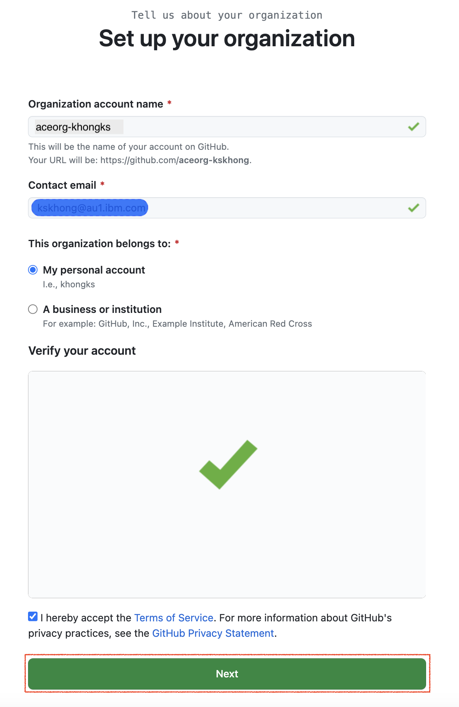

## Overview

This tutorial demonstrates a platform engineering approach to ACE development and
deployment. It demonstrates continuous integration, continuous deployment,
GitOps, Infrastructure as Code and DevOps using containers, Kubernetes and a set
of popular cloud native tools such as ArgoCD and Tekton.

In this tutorial, you will:

1. Create a Kubernetes cluster and image registry, if required.
2. Create an operational repository to store ACE resources that are
   deployed to the Kubernetes cluster.
3. Install ArgoCD to manage the continuous deployment of ACE-related
   resources to the cluster.
4. Create a source Git repository that holds the ACE development artifacts
   for a queue manager.
5. Install Tekton to provide continuous integration of the source ACE artifacts.
   These pipeline ensures that all changes to these artifacts are successful
   built, packaged, versioned and tested before they are delivered into the
   operational repository, read for deployment.
6. Gain experience with the IBM-supplied ACE operator and container.

By the end of the tutorial, you will have practical experience and knowledge of
platform engineering with ACE in a Kubernetes environment.

---

## Introduction

The following diagram shows a CICD pipeline for ACE:


Notice:

- The git repository `ace01-src` holds the source code for App Connect integration server such as message flows, ESQL, java code, configurations.
- A Tekton pipeline uses the `ace01-src` repository to build, package, test, version and deliver resources that define the `ace01` integration server.
- If the pipeline is successful, then the YAMLs that define `ace01` are stored in the operational repository `ace01-ops` and the container image for `ace01` is stored in an image registry.
- Shortly after the changes are committed to the git repository, an ArgoCD application detects the updated YAMLs. It applies them to the cluster to create or update a running queue manager, `ace01`.

This tutorial will walk you through the process of setting up this
configuration:
- Step 1: Follow the instructions in this README to set up your cluster, ArgoCD,
  the `ace01-ops` repository, and Tekton. Continue to step 2.
- Step 2: Move to [these
  instructions](https://github.com/ace-modernization-demo/ace01-src#readme) to create the
  `ace01-src` repository, run a Tekton pipeline to populate the `ace01-ops`
  repository, and interact with the new or updated integration server `ace01`.

---

## Prerequisites

- OpenShift Container Platform v4.10 or v4.12

## Tools needed

- OpenShift CLI - instructions [here](https://docs.openshift.com/container-platform/4.12/cli_reference/openshift_cli/getting-started-cli.html)
- jq CLI JSON processor - instructions [here](https://jqlang.github.io/jq/)
- Tekton CLI - instructions [here](https://tekton.dev/docs/cli/)

---

## Login to the cluster

From the your OpenShift web console console, select `Copy login command`, and
copy the login command.

Login to cluster using this command, for example:

```bash
oc login --token=sha256~noTAVal1dSHA --server=https://example.cloud.com:31428
```

which should return a response like this:

```bash
Logged into "https://example.cloud.com:31428" as "khongks@example.com" using the token provided.

You have access to 67 projects, the list has been suppressed. You can list all projects with 'oc projects'

Using project "default".
```

indicating that you are now logged into the Kubernetes cluster.

---

## Create a GitHub organization for your repositories

This tutorial requires you to create the `ace01-src` and `ace01-ops` repositories.
It's a good idea to create them in a separate organization because it makes it
easy to collaborate with your colleagues later on.

Click on the following URL: [https://github.com/settings/organizations](https://github.com/settings/organizations)
to create a new organization:

You will see a list of your existing GitHub organizations:


You're going to create a new organization for this tutorial.

Click on `New organization`:

This shows you the list of available plans:


The `Free` plan is sufficient for this tutorial.

Click on `Create a free organization`:

This shows you the properties for the new organization.



Complete the details for your new organization.

* Specify `Organization account name` of the form `aceorg-xxxxx` where `xxxxx` is
  your GitHub user name.
* Specify `Contact mail` e.g. `khongks@example.com`
* Select `My personal account`.

Once you've complete this page, click `Next`:

Your new organization `aceorg-xxxxx` has now been created:


You can add colleagues to this organization each with a particular role. For
now, we can use the organization as-is.

Click on `Complete setup` to complete the organization creation process.

Although you may see a few more screens, such as a usage survey, your
organization has been now been created. We will use it to host the `ace01-src` and `ace01-ops` repositories in this tutorial.

---

##  Useful environment variables

We now define some environment variables that are used by the commands in this tutorial to make them easy to use.

Define your GitHub user name in the `GITUSER` variable using the name you supplied above, e.g. `khongks`. Your GitHub user name will be used to 

Open a new Terminal window and type:
```bash
export GITUSER=khongks
export GITORG=aceorg-$GITUSER
```

Let's use this environment variable to examine your new organization in GitHub.

Enter the following command:
```bash
echo https://github.com/orgs/$GITORG/repositories
```

which will respond with a URL of this form:

```bash
https://github.com/orgs/aceorg-khongks/repositories
```

Navigate to this URL in your browser:


You can see that your new organization doesn't yet have any repositories in it. Let's start by adding the `ace01-ops` repository to it.

---

## Creating the `ace01-ops` repository

We use a [template repository](https://github.com/ace-modernization-demo/ace01-ops) to
create `ace01-ops` in our new organization. Forking a template creates a repository with a clean git history, allowing us to track the history of changes to our cluster every time we update `ace01-ops`.

Click on [this
URL](https://github.com/ace-modernization-demo/ace01-ops/generate) to fork from the `ace01-ops` template repository:


This screen allows you to define the properties for your copy of the `ace01-ops` repository.

Specifically:

* In the `Owner` dropdown, select your newly created organization, e.g. `aceorg-xxxxx`
* In the `Repository name` field, specify `ace01-ops`.
* In the `Description` field, specify `Operational repository for ACE`.
* Select `Public` for the repository visibility.

Click on `Create repository from template`:

This repository will be cloned to the specified GitHub account:


You have successfully created a copy of the `ace01-ops` repository in your organization.

---

## Enable Personal Access Tokens for your new organization

To allow sufficient, but limited, access the repositories in our new Git
organization, we use a [Personal Access Token
](https://docs.github.com/en/authentication/keeping-your-account-and-data-secure/creating-a-personal-access-token)
(**PAT**). First, we must enable this feature using the GitHub web.

Issue the following command:
```bash
echo https://github.com/organizations/$GITORG/settings/personal-access-tokens-onboarding
```

Navigate to this URL in your browser and complete the workflow:


Select the following options via their radio buttons:

1. Select `Allow access via fine-grained personal access tokens` and hit `Continue`
2. Select `Do not require administrator approval` and hit `Continue`
3. Select `Allow access via personal access tokens (classic)` and hit `Continue`
4. Complete the process and hit `Enroll` to enable PATs for your organization

Personal Access Tokens are now enabled for your GitHub organization.

## Create Personal Access Token for GitHub access

We now create a PAT to limit access to only repositories in the new GitHub
organization. This token will be used by the tutorial CLI and Tekton service
account, thereby limiting exposure of your other GitHub resources; this is a
nice example of **Zero Trust** security, limiting access to only what's
required.

Navigate to https://github.com/settings/tokens?type=beta in your Browser:


Complete the page as follows:

1. `Token Name`: `ACE tutorial access`
2. `Description`: `This token allows a user to clone repositories and create/merge PRs`
3. `Resource Owner` drop-down:  Select your organization e.g. `aceorg-khongks`
4. Select the `All repositories` radio button
5. Under `Repository permissions` select:
   * `Contents`: `Read and write`
   * `Pull requests` : `Read and write`
6. (No changes under `Organization permissions`)

Click on `Generate token` to create a PAT which has the above access encoded
within it.


---

## Store PAT for later use

Copy the PAT token and store in a file on your local machine; we'll use it later.

In the meantime, we're going to store in an environment variable.
```bash
export GITTOKEN=<PAT copied from GitHub>
```

Let's now use this token to create our own copies of the `ace01-src` and
`ace01-ops` repositories.

---

## Clone repository to your local machine

We're going to use the contents of this repository to configure our cluster. To
do this we need to clone this repository to our local machine.

It's best practice to store cloned git repositories under a folder called `git`,
with subfolders that correspond to your projects.

Issue the following commands to create this folder structure and clone the
`ace01-ops` repository from GitHub to your local machine.

```bash
mkdir -p $HOME/git/$GITORG-tutorial
cd $HOME/git/$GITORG-tutorial
git clone https://$GITTOKEN@github.com/$GITORG/ace01-ops.git
cd ace01-ops
```

---

## Create ACE development namespace

Let's use some YAML in `ace01-ops` to define two namespaces in our cluster:

Issue the following command:

```bash
oc apply -f setup/namespaces.yaml
```

which will confirm the following namespaces are created in the cluster:

```bash
namespace/ace01-ci created
namespace/ace01-dev created
```

As the tutorial proceeds, we'll see how the YAMLs in `ace01-ops` **fully** define
the ACE related resources deployed to the cluster. In fact, we're going to set up
the cluster such that it is **automatically** updated whenever the `ace01-ops`
repository is updated. This concept is called **continuous deployment** and
we'll use ArgoCD to achieve it.

---

## Explore the `ace01-ops` repository

You can explore the contents of the `ace01-ops` repository.

The `environment` folder which contains the YAML files that will be monitored and deployed by GitOps.

- `ci` folder contains deployment for the namespace `ace01-ci`.
  - `pipelines` folder contains the YAML files to deploy Tekton Pipelines & Tasks in the `ace01-01` namespace.
- `dev` folder contains deployment for the namespace `ace01-dev`.
  - `ace01` folder contains the YAML files to deploy App Connect dashboard and integration server.

```bash
.
├── ci
│   └── pipelines
│       ├── pipeline.yaml
│       └── tasks
│           ├── buildah.yaml
│           ├── convert-p12-to-jks.yaml
│           ├── create-bar.yaml
│           ├── create-config.yaml
│           ├── create-data-source.yaml
│           ├── create-integration-server.yaml
│           ├── create-policy-project.yaml
│           ├── docker-build.yaml
│           ├── git-cli.yaml
│           ├── git-clone.yaml
│           ├── read-secret.yaml
│           ├── run-tests.yaml
│           └── update-templates.yaml
├── dev
│   ├── ace01
│   │   ├── dashboard.yaml
├── prod
└── stage
```

The `setup` folder which contains the YAML files needed to setup the demo. It contains the following subfolders.

| Files | Descriptions |
| --- | --- |
| `argocd/ci` | Contains script and template to create  ArgoCD application to deploy Tekton Pipelines & Tasks. |
| `argocd/dev` | Contains script and template to create ArgoCD application to deploy App Connect dashboard and integration server. |
| `catalogsources/catalog-sources.yaml` | Used to create CatalogSource |
| `imagestreams/imagestream.yaml` | used to create a ACE Docker image `cp.icr.io/cp/appc/ace-server-prod` in OpenShift image registry so that you don't have to pull from external image registry. |
| `namespaces/namespaces.yaml` | used to create two namespaces `ace01-ci` and `ace01-dev` |
| `operators` | folder container YAML files to deploy the operators `ibm-appconnect`, `openshift-gitops-operator` and `openshift-pipelines-operator` (Tekton). |
| `permissions` |  |
| `ace-pipeline-deployer-role.yaml`<br>`ace-pipeline-deployer-rolebinding.yaml`<br>`ace-pipeline-deployer-serviceaccount.yaml`| Allow the Tekton to deploy App Connect components | 
| `ace-role.yaml`<br>`ace-rolebinding.yaml` | Allow Gitops (ArgoCD) to deploy App Connect components |
| `tekton-role.yaml`<br>`tekton-rolebinding.yaml` | Allow Gitops (ArgoCD to deploy Tekton components) |
| `secrets` | Contains scripts to Git credential secrets and Dockerconfig secret |


```bash
.
├── argocd
│   ├── ci
│   │   ├── ci.yaml.tmpl
│   │   └── create-yaml.sh
│   └── dev
│       ├── ace01.yaml.tmpl
│       └── create-yaml.sh
├── catalogsources
│   └── catalog-sources.yaml
├── imagestreams
│   └── imagestream.yaml
├── namespaces
│   └── namespaces.yaml
├── operators
│   ├── ace-operator-sub.yaml
│   ├── argocd-operator-sub.yaml
│   └── tekton-operator-sub.yaml
├── permissions
│   ├── ace-pipeline-deployer-role.yaml
│   ├── ace-pipeline-deployer-rolebinding.yaml
│   ├── ace-pipeline-deployer-serviceaccount.yaml
│   ├── ace-role.yaml
│   ├── ace-rolebinding.yaml
│   ├── tekton-role.yaml
│   └── tekton-rolebinding.yaml
└── secrets
    ├── create-dockerconfig-secret.sh
    ├── create-gitcredentials-secret.sh
```

---

### Create namespace

Issue the following command to create the namespaces.

```bash
oc apply -f setup/namespaces/namespaces.yaml
```

Use the following command to show these namespaces in the cluster

```bash
oc get namespaces ace01-ci ace01-dev
```

which will shows these namespaces and their age, for example:

```bash
NAME        STATUS   AGE
ace01-ci    Active   26d
ace01-dev   Active   26d
```

During this tutorial, we'll see how:

If you'd like to understand a little bit more about how the namespaces were created, 

- the `ace01-ci` namespace is used to store specific Kubernetes resources to build, package, version and test `ace01`.
- the `ace01-dev` namespace is used to store specific Kubernetes resources relating to a running queue manager, `ace01`.

---

## Create ArgoCD subscription

Let's install ArgoCD to enable continuous deployment.

Use the following command to create a subscription for ArgoCD:

```bash
oc apply -f setup/operators/argocd-operator-sub.yaml
```

which will create a subscription for ArgoCD:

```bash
subscription.operators.coreos.com/openshift-gitops-operator created
```

Explore the subscription using the following command:

```bash
cat setup/argocd-operator-sub.yaml
```

which details the subscription:

```yaml
apiVersion: operators.coreos.com/v1alpha1
kind: Subscription
metadata:
  name: openshift-gitops-operator
  namespace: openshift-operators
spec:
  channel: stable
  installPlanApproval: Automatic
  name: openshift-gitops-operator
  source: redhat-operators
  sourceNamespace: openshift-marketplace
```

See if you can understand each YAML node, referring to
[subscriptions](https://olm.operatorframework.io/docs/concepts/crds/subscription/) if you need to learn more.

ArgoCD will now install; this may take a few minutes.

## Verify ArgoCD installation

A [ClusterServiceVersion](https://olm.operatorframework.io/docs/concepts/crds/clusterserviceversion/) (CSV) is created for each release of the ArgoCD operator installed in the cluster. This tells Operator Lifecycle Manager how to deploy and run the
operator.

We can verify that the installation has completed successfully by examining the CSV for ArgoCD.

Issue the following command:

```bash
oc get clusterserviceversion openshift-gitops-operator.v1.5.10 -n openshift-gitops
```

```bash
NAME                               DISPLAY                    VERSION   REPLACES                                          PHASE
openshift-gitops-operator.v1.5.10  Red Hat OpenShift GitOps   1.5.10    openshift-gitops-operator.v1.5.6-0.1664915551.p   Succeeded
```

See how the operator has been successfully installed at version 1.5.10.

Feel free to explore this CSV:

```bash
oc describe csv openshift-gitops-operator.v1.5.10 -n openshift-operators
```

The output provides an extensive amount of information not listed
here; feel free to examine it.

## Minor modifications to ArgoCD

ArgoCD will deploy `ace01-dev` and its related resources to the cluster. These resources are labelled by ArgoCD with a specific `applicationInstanceLabelKey` so that they can be tracked for configuration drift. The default label used by ArgoCD collides with ACE operator, so we need to change it.

Issue the following command to change the `applicationInstanceLabelKey`used by ArgoCD:

```bash
oc patch argocd openshift-gitops  \
 --namespace openshift-gitops \
 --type merge \
 --patch '{"spec":{"applicationInstanceLabelKey":"argocd.argoproj.io/instance"}}'
```

which should respond with:

```bash
argocd.argoproj.io/openshift-gitops patched
```

which confirms that the ArgoCD operator has been patched and will now add this label to every resource it deploys to the cluster.

---

## ACE Deployer role and role binding for GitOps ArgoCD

ArgoCD requires permission to create App Connect resources in the `ace01-dev` namespace. We use a `role` to define the resources required to deploy dashboard, integration server and configuration, and a `rolebinding` to associate this `role` with the `serviceaccount` associated with ArgoCD (`openshift-gitops-applicationset-controller`) ~ auto-created when ArgoCD is installed.

Issue the following command to create this `ace-deployer` role:

```bash
oc apply -f setup/permissions/ace-role.yaml
```

which confirms that the `ace-deployer` role has been created:

```bash
role.rbac.authorization.k8s.io/ace-deployer created
```

Issue the following command to create the corresponding `ace-deployer` rolebinding:

```bash
oc apply -f setup/permissions/ace-rolebinding.yaml
```

which confirms that the `ace-deployer` role binding has been created:

```bash
rolebinding.rbac.authorization.k8s.io/ace-deployer
```

We can see which resources ArgoCD can create in the cluster by examining the `ace-deployer` role:

```bash
oc describe role ace-deployer -n ace01-dev
```

which returns:

```bash
Name:         ace-deployer
Labels:       <none>
Annotations:  <none>
PolicyRule:
  Resources                              Non-Resource URLs  Resource Names  Verbs
  ---------                              -----------------  --------------  -----
  secrets                                []                 []              [*]
  services                               []                 []              [*]
  configurations.appconnect.ibm.com      []                 []              [*]
  integrationservers.appconnect.ibm.com  []                 []              [*]
```

See how ArgoCD can now control `secrets`, `services`, `configurations.appconnect.ibm.com` and `integrationservers.appconnect.ibm.com` with all operations such as create, read, update and delete (i.e. `Verbs[*]`).

---

## Pipeline Deployer role and role binding for GitOps ArgoCD

ArgoCD requires permission to create OpenShift Pipelines (Tekton) resources in the `ace01-ci` namespace. We use a `role` to define the resources required to deploy pipeline, tasks and a `rolebinding` to associate this `role` with the `serviceaccount` associated with ArgoCD (`openshift-gitops-applicationset-controller`) ~ auto-created when ArgoCD is installed.

Issue the following command to create this `pipeline-deployer` role:

```bash
oc apply -f setup/permissions/pipeline-role.yaml
```

which confirms that the `pipeline-deployer` role has been created:

```bash
role.rbac.authorization.k8s.io/pipeline-deployer created
```

Issue the following command to create the corresponding `pipeline-deployer` rolebinding

```bash
oc apply -f setup/permissions/pipeline-rolebinding.yaml
```

which confirms that the `pipeline-deployer` role binding has been created:

```bash
rolebinding.rbac.authorization.k8s.io/pipeline-deployer
```

We can see which resources ArgoCD can create in the cluster by examining the `pipeline-deployer` role:

```bash
oc describe role pipeline-deployer -n ace01-ci
```

which returns:

```bash
Name:         pipeline-deployer
Labels:       <none>
Annotations:  <none>
PolicyRule:
  Resources                                   Non-Resource URLs  Resource Names  Verbs
  ---------                                   -----------------  --------------  -----
  clusterinterceptors.tekton.dev              []                 []              [*]
  clustertasks.tekton.dev                     []                 []              [*]
  customruns.tekton.dev                       []                 []              [*]
  pipelineruns.tekton.dev                     []                 []              [*]
  pipelines.tekton.dev                        []                 []              [*]
  taskruns.tekton.dev                         []                 []              [*]
  tasks.tekton.dev                            []                 []              [*]
  verificationpolicies.tekton.dev             []                 []              [*]
  clustertriggerbindings.triggers.tekton.dev  []                 []              [*]
  eventlisteners.triggers.tekton.dev          []                 []              [*]
  interceptors.triggers.tekton.dev            []                 []              [*]
  triggerbindings.triggers.tekton.dev         []                 []              [*]
  triggers.triggers.tekton.dev                []                 []              [*]
  triggertemplates.triggers.tekton.dev        []                 []              [*]
```

See how ArgoCD can now control `pipelines`, `tasks` and other objects with all operations such as create, read, update and delete (i.e. `Verbs[*]`).

---

## Add IBM catalog sources

Like ArgoCD, there is a dedicated operator that manages queue managers in the cluster. Unlike ArgoCD, its definition is held in the IBM [catalog source](https://olm.operatorframework.io/docs/concepts/crds/catalogsource/), so we need to add this catalog source to the cluster before we can install it.

Issue the following command:

```bash
oc apply -f setup/catalogsources/catalog-sources.yaml
```

which will add the catalog sources defined in this YAML to the cluster:

```bash
catalogsource.operators.coreos.com/opencloud-operators created
catalogsource.operators.coreos.com/ibm-operator-catalog created
```

Notice, that there actually **two** new catalog sources added; feel free to examine the catalog source YAML:

```bash
cat setup/catalogsources/catalog-sources.yaml
```

which shows you the detailed YAML for these catalog sources:

```bash
apiVersion: operators.coreos.com/v1alpha1
kind: CatalogSource
metadata:
  name: opencloud-operators
  namespace: openshift-marketplace
spec:
  displayName: IBMCS Operators
  publisher: IBM
  sourceType: grpc
  image: docker.io/ibmcom/ibm-common-service-catalog:latest
  updateStrategy:
    registryPoll:
      interval: 45m
---
apiVersion: operators.coreos.com/v1alpha1
kind: CatalogSource
metadata:
  name: ibm-operator-catalog
  namespace: openshift-marketplace
spec:
  displayName: IBM Operator Catalog
  image: 'icr.io/cpopen/ibm-operator-catalog:latest'
  publisher: IBM
  sourceType: grpc
  updateStrategy:
    registryPoll:
      interval: 45m
```

Examine these YAMLs to see if you can understand [how they
work](https://olm.operatorframework.io/docs/concepts/crds/catalogsource/).

---

## Install ACE operator

We can now install the ACE operator; using the same process as we used with ArgoCD.

Issue the following command:

```bash
oc apply -f setup/operators/ace-operator-sub.yaml
```

which will create the ACE operator subscription:

```bash
subscription.operators.coreos.com/ace-operator created
```

Explore the subscription using the following command:

```bash
cat setup/operators/ace-operator-sub.yaml
```

which details the subscription:

```yaml
apiVersion: operators.coreos.com/v1alpha1
kind: Subscription
metadata:
  labels:
    operators.coreos.com/ibm-appconnect.openshift-operators: ""
  name: ibm-appconnect
  namespace: openshift-operators
spec:
  channel: v9.1
  installPlanApproval: Automatic
  name: ibm-appconnect
  source: ibm-operator-catalog
  sourceNamespace: openshift-marketplace
  startingCSV: ibm-appconnect.v9.1.0
```

Notice how this operator is installed in the `openshift-operators` namespace. Note also the use of `channel` and `startingCSV` to be precise about the exact version of the ACE operator to be installed.

Again, feel free to verify the ACE installation with the following commands:

```bash
oc get clusterserviceversion ibm-appconnect.v9.1.0 -n openshift-operators
```

```bash
NAME                    DISPLAY   VERSION   REPLACES   PHASE
ibm-appconnect.v9.1.0   IBM       9.1.0                Succeeded
```

which shows that the 9.1.0 version of the operator has been successfully installed.

```bash
oc describe csv ibm-appconnect.v9.1.0 -n openshift-operators
```

The output provides an extensive amount of information not listed here; feel free to examine it.

---

## Install Tekton pipelines

Our final task is to install Tekton. With it, we can create pipelines that populate the operational repository `ace01-ops` using the ACE configuration and development artifacts stored in `ace01-src`. Once populated by Tekton, ArgoCD will then synchronize these artifacts with the cluster to ensure the cluster is running the most up-to-date version of `ace01`.

Issue the following command to create a subscription for Tekton:

```bash
oc apply -f setup/operators/tekton-operator-sub.yaml
```

which will create a subscription:

```bash
subscription.operators.coreos.com/openshift-pipelines-operator created
```

Again, this subscription enables the cluster to keep up-to-date with new version of Tekton.

Explore the subscription using the following command:

```bash
cat setup/operators/tekton-operator-sub.yaml
```

which details the subscription:

```yaml
apiVersion: operators.coreos.com/v1alpha1
kind: Subscription
metadata:
  name: openshift-pipelines-operator
  namespace: openshift-operators
spec:
  channel:  latest
  installPlanApproval: Automatic
  name: openshift-pipelines-operator-rh
  source: redhat-operators
  sourceNamespace: openshift-marketplace
```

Manual Tekton install:

```bash
oc apply -f https://storage.googleapis.com/tekton-releases/pipeline/latest/release.yaml
```
---

Again, feel free to verify the Tekton installation with the following commands:

```bash
oc get clusterserviceversion -n openshift-operators
```

(replacing `x.y.z` with the installed version of Tekton)

```bash
oc describe csv openshift-pipelines-operator-rh.vx.y.z -n openshift-operators
```

---

## Create a secret to contain the Github Personal Access Token (PAT) use by Pipelines (Tekton)

The PAT we created earlier is now stored as a secret called `gitcredentials-secret` in the `ace01-ci` namespace and used by the pipeline whenever it needs to access the `ace01-src` and `ace01-ops` repositories.

Issue the following command to create a secret containing the Personal Access Token (PAT):

```bash
export GITUSER=<Your Github username>
export GITTOKEN=<Your Github PAT>

cd setup/secrets
./create-gitcredentials-secret.sh
```

<!-- Finally, add this secret to the `pipeline` service account to allow it to use `ace-1-ssh-credentials` secret to access GitHub.

```bash
oc patch serviceaccount pipeline \
    --namespace ace01-ci \
    --type merge \
    --patch '{"secrets":[{"name":"ace01-git-credentials"}]}'
``` -->
---

## Create a secret to contain the Dockerconfig use by Pipelines (Tekton)

Following the instructions [here](https://www.ibm.com/docs/en/cloud-paks/cp-integration/2023.2?topic=fayekoi-finding-applying-your-entitlement-key-by-using-ui-online-installation) to obtain the IBM entitlement key for Cloud Pak for Integration.

Issue the following command to create a secret containing the Dockerconfig:

```bash
export IBM_ENTITLEMENT_KEY=<Your IBM entitlement key>

cd setup/secrets
./create-dockerconfig-secret.sh
```

---

## ACE Pipeline Deployer role and role binding for OpenShift Pipelines (Tekton)

Issue the following command to create a `serviceaccount` for Pipeline (Tekton):

```bash
oc apply -f setup/permissions/ace-pipeline-serviceaccount.yaml
```

Issue the following command to create a `role` that allows the `serviceaccount` to manipulate `imagestreams`, `buildconfig`, etc.

```bash
oc apply -f setup/permissions/ace-pipeline-deployer-role.yaml
```

Finally, issue the following command to create a `rolebinding` that links the `serviceaccount` to its `role`:

```bash
oc apply -f setup/permissions/ace-pipeline-rolebinding.yaml
```

---

## Create a imagestream for IBM Certified Container image

Issue the following command to create an imagestream of the IBM Certified image.

```bash
oc apply -f setup/imagestreams/imagestream.yaml
```

Review the YAML file

```bash
cat setup/imagestreams/imagestream.yaml
```

The `ace-server-prod` IBM certified container image pulled into the buit-in OpenShift image registry for easier access. 
```
kind: ImageStream
apiVersion: image.openshift.io/v1
metadata:
  name: ace-server-prod
  namespace: ace01-ci
spec:
  lookupPolicy:
    local: false
  tags:
    - name: latest-amd64
      from:
        kind: DockerImage
        name: cp.icr.io/cp/appc/ace-server-prod@sha256:246828d9f89c4ed3a6719cd3e4b71b1dec382f848c9bf9c28156f78fa05bc4e7
      importPolicy:
        importMode: Legacy
      referencePolicy:
        type: Source   
```


<!-- ## Allow the `serviceaccount` of ibm

## Image registry

Allow Tekton to write to image registry


```bash
oc policy add-role-to-user system:image-puller system:serviceaccount:ace01-dev:ace01-ibm-appconnect --namespace=ace01-ci
```

```bash
// oc adm policy  add-cluster-role-to-user edit system:serviceaccount:ace01-ci:pipeline // not sure we need this? -->

---

## An ArgoCD application to manage `ace01-ci`

Finally, we're going to create an ArgoCD application to manage the ACE integration server `ace01`. The YAMLs for `ace01` will be created by its Tekton pipeline in
`ace01-ops`. Every time this repository is updated, our ArgoCD application will ensure that the latest version of `ace01` is deployed to the cluster.


## An ArgoCD application to manage `ace01-dev`

Finally, we're going to create an ArgoCD application to manage the ACE integration server `ace01`. The YAMLs for `ace01` will be created by its Tekton pipeline in
`ace01-ops`. Every time this repository is updated, our ArgoCD application will ensure that the latest version of `ace01` is deployed to the cluster.

Let's have a quick look at our ArgoCD application.

Issue the following command:

```bash
cat environments/dev/argocd/ace01.yaml
```

which will show its YAML:

```yaml
apiVersion: argoproj.io/v1alpha1
kind: Application
metadata:
  name: ace01-argo
  namespace: openshift-gitops
  annotations:
    argocd.argoproj.io/sync-wave: "100"
  finalizers:
    - resources-finalizer.argocd.argoproj.io
spec:
  destination:
    namespace: ace01-dev
    server: https://kubernetes.default.svc
  project: default
  source:
    path: environments/dev/ace01/
    repoURL: https://github.com/$GITORG/ace01-ops.git
    targetRevision: main
  syncPolicy:
    automated:
      prune: true
      selfHeal: true
    syncOptions:
      - Replace=true
```

Notice how the Argo application monitors a specific GitHub location for
resources to deploy to the cluster:

```yaml
  source:
    path: environments/dev/ace01/
    repoURL: https://github.com/$GITORG/ace01-ops.git
    targetRevision: main
```

See how:
  - `repoURL: https://github.com/$GITORG/ace01-ops.git` identifies the repository
    where the YAMLs are located ($GITORG will be replaced with your GitHub organization)
  - `targetRevision: main` identifies the branch within the repository
  - `path: environments/dev/ace01/` identifies the folder within the repository

## Deploy `ac01-argo` to the cluster

Let's deploy this ArgoCD application to the cluster. We use the `envsubst`
command to replace $GITORG with your GitHub organization.

Issue the following command:

```bash
envsubst < environments/dev/argocd/ace01.yaml.tmpl >> environments/dev/argocd/ace01.yaml
oc apply -f environments/dev/argocd/ace01.yaml
```

which will complete with:

```bash
application.argoproj.io/ace01-argo created
```

We now have an ArgoCD application monitoring our repository.

## View `ace01-argo` in ArgoCD UI

We can use the ArgoCD UI to look at the `ace01-argo` application and the
resources it is managing:

Issue the following command to identify the URL for the ArgoCD login page:

```bash
oc get route openshift-gitops-server -n openshift-gitops -o jsonpath='{"https://"}{.spec.host}{"\n"}'
```

which will return a URL similar to this:

```bash
https://openshift-gitops-server-openshift-gitops.apps.ocp-3100015379-l0ri.cloud.techzone.ibm.com/
```

We will use this URL to log into the ArgoCD admin console to view our deployments.

Issue the following command to determine the ArgoCD `password` for the `admin`
user:

```bash
oc extract secret/openshift-gitops-cluster -n openshift-gitops --keys="admin.password" --to=-
```

Login to ArgoCD with `admin` and `password`.

> **Note**<br>
>
> If DNS name resolution has not been set up for your cluster hostname, you will
> need to add the URL hostname to your local machine  `/etc/hosts` file to
> identify the IP address of the ArgoCD server, e.g.:
>
> `141.125.162.227 openshift-gitops-server-openshift-gitops.apps.sno-ajo-1.snoajo1.com`

Upon successful login, you will see the following screen:


Notice how the ArgoCD application `ace01-argo` is monitoring the
`https://github.com/aceorg-khongks/ace01-ops` repository for YAMLs in the
`environments/dev/ace01` folder.

In the next step we will run the Tekton pipeline that populates this repository
folder with the YAMLs for the `ace01` queue manager.

---

## Congratulations

You've configured your cluster for ACE. Let's run a pipeline to populate the `ace01-ops` repository. This pipeline is held in the source repository `ace01-src`; it also holds the configuration for the `ace01` queue manager.

Continue [here](https://github.com/ace-modernization-demo/ace01-src#introduction) to fork your copy of the `ace01-src` repository.

---
